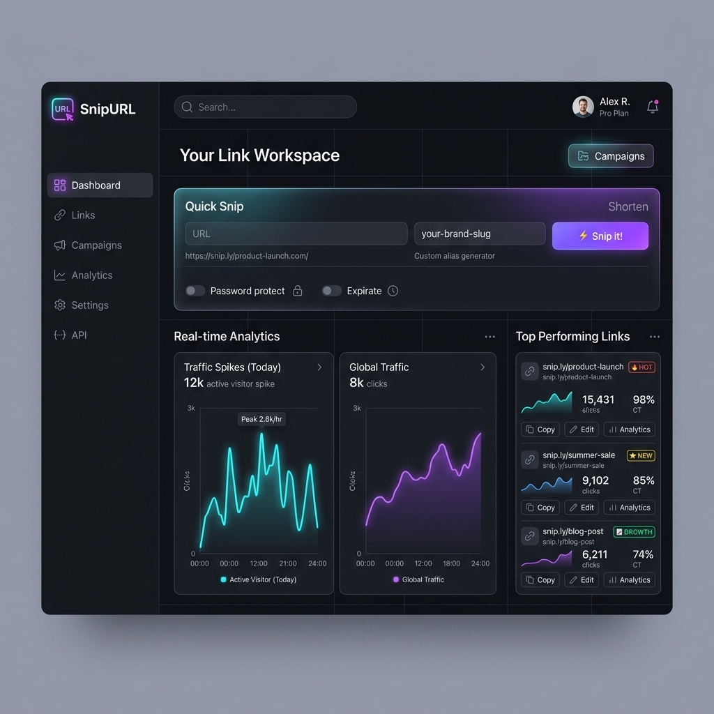
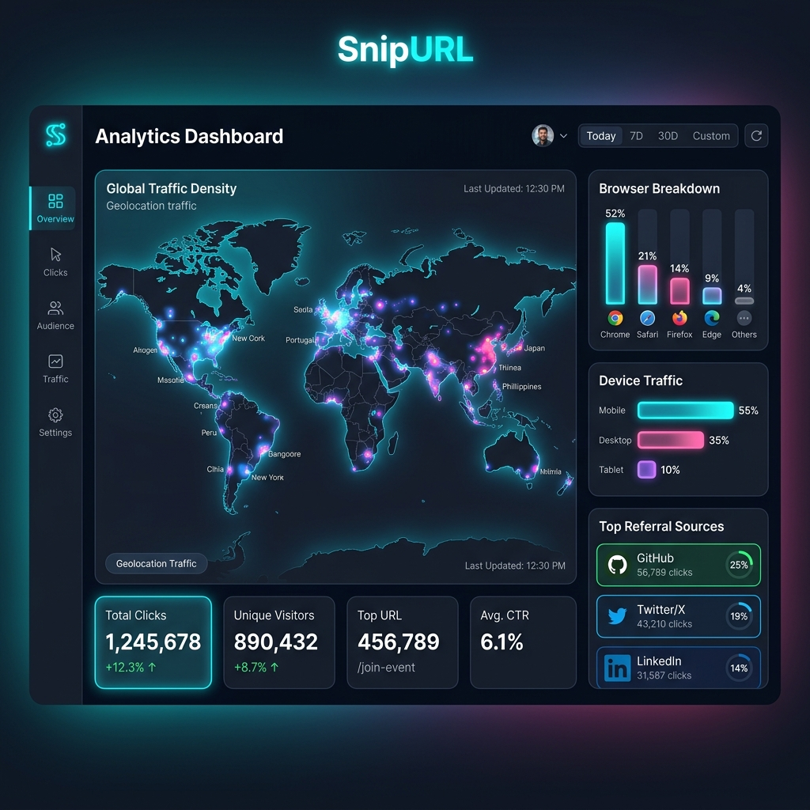
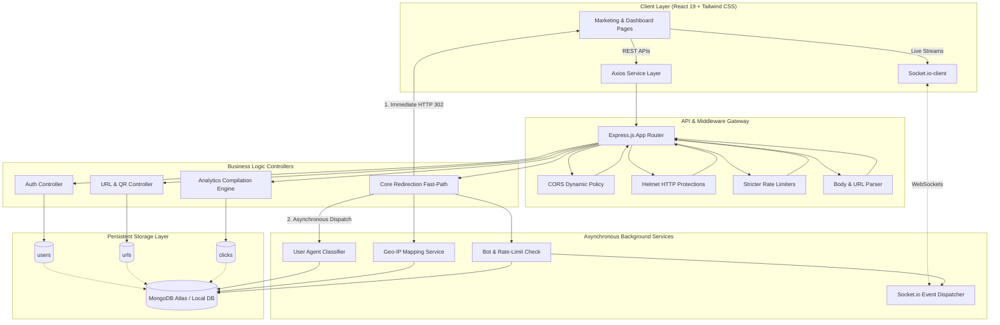
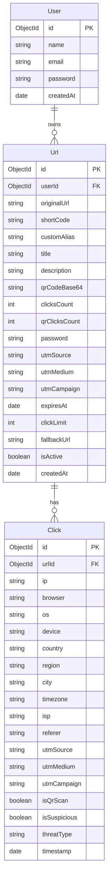

# SnipURL - Premium URL Shortener & Analytics SaaS Platform

[](https://nodejs.org/)
[](https://react.dev/)
[](https://www.mongodb.com/atlas)
[](https://socket.io/)
[](https://tailwindcss.com/)
[](https://opensource.org/licenses/MIT)

An enterprise-grade, visually stunning **URL Shortener & Analytics SaaS Platform** designed to offer sub-millisecond visitor redirection, high-fidelity tracking, custom Base64 QR code generation, robust bot & click-spam protection, and real-time live data streaming.

Inspired by industry-defining developer portals like **Vercel, Stripe, and Linear**, SnipURL fuses a gorgeous dark-mode responsive React 19 client with a secure, rate-limited Node.js Express API and a scalable MongoDB Atlas database.

---

## 🎨 Application Screenshots

### Administrative Dashboard
The central dashboard displays clean metrics cards with interactive Recharts graphics, dynamic custom short-link configurations, and a quick-alias creation panel.


### High-Fidelity Analytics & Insights
Visualizes geographic visitor density on an interactive map, and features comprehensive browser/device breakdowns, referral tracking, and live-streaming click logs.


---

## 🎥 Video Demonstration

> [!TIP]
> **YouTube Video Preview Template:** Once you record your walk-through video, replace the link and the image source below with your YouTube URL to show off your working application directly in the GitHub repo!

[]
---

## 🏛️ Advanced Architecture Overview

SnipURL implements a modular full-stack architecture that splits critical, speed-sensitive client redirects from intensive data analytics and persistent database logs.

### 1. Component Level Architecture
The flowchart below illustrates how components interact across frontend frameworks, security filters, backend routes, background processing threads, and persistent MongoDB collections:



### 2. Sub-Millisecond Redirection Sequence
The sequence diagram below displays how the server processes short URLs. To achieve maximum redirect speeds, the server fires an HTTP `302 Found` redirection immediately upon locating the destination URL, and **spawns an asynchronous background worker** to handle geo-location lookup, device parsing, bot auditing, database logging, and WebSocket emission.

```mermaid
sequenceDiagram
    autonumber
    actor Visitor as Visitor Web Client
    participant Server as Express Redirect Route
    participant Database as MongoDB (Mongoose)
    participant External as IP-API Geolocation
    participant Admin as Admin Socket.io Client

    Visitor->>Server: GET /r/:shortCode (Headers: User-Agent, Referer, Client IP)
    activate Server
    Server->>Database: Url.findOne({ shortCode, isActive: true })
    activate Database
    Database-->>Server: URL metadata (Original URL, password, constraints)
    deactivate Database
    
    Note over Server: Validate password/limitations/expiration
    
    Server-->>Visitor: HTTP 302 Found (Instant Redirection to originalUrl)
    deactivate Server
    Note over Visitor: Visitor redirected immediately. zero load lag!

    Note right of Server: Asynchronous Background Thread Initiated

    rect rgb(30, 25, 45)
        Note over Server: User Agent classification (Browser, OS, Device)
        Note over Server: Bot & Crawler fraud check (UA check, IP spam count)
        
        alt Client IP is Loopback / Localhost
            Note over Server: Inject random high-fidelity geographical fallback
        else Public Client IP
            Server->>External: GET http://ip-api.com/json/:ip
            activate External
            External-->>Server: Geo Data (Country, region, city, ISP)
            deactivate External
        end
        
        Server->>Database: Click.create({ click logs metadata })
        Server->>Database: Url.updateOne({ clicksCount += 1 })
        
        Server->>Admin: socket.emit('new-click', clickPayload)
        Note over Admin: Admin charts dynamically update in real-time!
    end
```



### 3. Database Schema Relationships
SnipURL maintains strict referential integrity within MongoDB utilizing dynamic Mongoose schemas. User accounts own multiple URLs, and each URL cascades click metrics down to individual visual tracking records:



---

## ⚡ Core Advanced Features

- **⚡ Sub-Millisecond Redirection (Instant-Redirect Pattern)**
  Rather than keeping users waiting while the database writes click logs and contacts geo-servers, the API resolves the document, returns a standard `302 Found` header, and schedules analytical auditing processes in a parallel background execution thread.
- **🛡️ Bot-Defense & Fraud Verification**
  Filters out automated crawlers, web spiders, and headless browsers via customizable User-Agent regular expressions. Tracks user IP click frequency over sliding 10-second intervals to detect and quarantine spam attempts, updating dashboard threat scores.
- **🔌 Real-Time WebSocket Updates**
  Integrates Socket.io rooms to segment analytics streams. When a short link is clicked, the background worker sends live click logs and updated counts immediately to the creator's visual dashboard, creating a real-time, interactive user experience.
- **🌍 High-Fidelity Geolocation Engine**
  Resolves visitor IPs to geographical metadata (country, region, city, ISP, timezone) via deep external lookups. During local development on localhost loopback (`127.0.0.1`), the system automatically injects high-fidelity mockup location records to populate dashboard maps immediately with interesting data.
- **🔐 Enterprise Security Configurations**
  Protects accounts and links via multi-layered security protocols:
  - **Helmet.js** HTTP header injection for standard script defenses.
  - **Express-Rate-Limit** restricting auth interfaces to prevent brute-force attacks.
  - **Express-Validator** schemas verifying URL inputs, custom aliases, and payloads.
  - **Password Protection & Expirations** allowing users to restrict links with passwords, maximum click counts, and auto-expiry schedules with optional fallback redirect targets.

---

## 📁 Workspace Folder Structure

```
URL_short/
├── assets/                   # High-fidelity project screenshots & mockups
├── backend/                  # Node.js + Express.js Backend
│   ├── config/               # DB connections & environment loaders
│   ├── controllers/          # Business logic handlers (Auth, URLs, Analytics, Redirects)
│   ├── middleware/           # Route guard, Rate limiters, Error handlers
│   ├── models/               # MongoDB Mongoose models (User, Url, Click)
│   ├── routes/               # API endpoint route definitions
│   ├── utils/                # UA parser, base64 QR compiler, Socket manager
│   ├── validators/           # Request input validation schemas
│   └── server.js             # Main server bootloader & WebSocket server
├── frontend/                 # Vite + React 19 Frontend
│   ├── public/               # Static assets & favicon files
│   ├── src/
│   │   ├── components/       # UI charts, metric cards, navigation blocks
│   │   ├── contexts/         # Theme toggles & persistent auth sessions
│   │   ├── hooks/            # Custom notification alerts portal
│   │   ├── layouts/          # Responsive grid structures & layouts
│   │   ├── pages/            # Landings, logins, dashboards, public stats
│   │   ├── services/         # Axios API connection handlers
│   │   ├── index.css         # Google Fonts, styling variables, Glassmorphism
│   │   └── App.jsx           # Client router setup
│   └── tailwind.config.js    # Custom Tailwind styling tokens
└── README.md                 # Project documentation
```

---

## 🔑 Environment Configuration

### Backend Setup (`backend/.env`)
Create a `.env` file inside the `backend/` directory with the following variables:
```env
PORT=5000
MONGODB_URI=mongodb://127.0.0.1:27017/url_shortener_db
JWT_SECRET=super_secret_jwt_passkey_123_abc_xyz_hackathon_99
FRONTEND_URL=http://localhost:5173
BASE_URL=http://localhost:5000
```

---

## 🚀 Setup & Execution Guide

### Prerequisites
- **Node.js** installed (v18+ recommended)
- **MongoDB** running locally on port 27017 or a MongoDB Atlas connection string loaded into the backend environment.

### Step 1: Run the Backend Server
1. Navigate to the backend directory:
   ```bash
   cd backend
   ```
2. Install dependencies:
   ```bash
   npm install
   ```
3. Start the dev server:
   ```bash
   npm run dev
   ```
   *The server will boot on `http://localhost:5000` and establish a database connection.*

### Step 2: Run the Frontend Client
1. Open a new terminal and navigate to the frontend directory:
   ```bash
   cd frontend
   ```
2. Install dependencies:
   ```bash
   npm install
   ```
3. Start the Vite development server:
   ```bash
   npm run dev
   ```
   *The client will boot on `http://localhost:5173`. Open this URL in your browser.*

---

## 🔌 API Documentation

All API requests are prefixed with `/api`. Protected routes require the standard header: `Authorization: Bearer <JWT_TOKEN>`.

### 🔐 1. Authentication Endpoints

| HTTP Method | Route Path | Access | Request Payload | Success Response Codes |
| :--- | :--- | :--- | :--- | :--- |
| **POST** | `/auth/register` | Public | `{ "name": "Jane", "email": "jane@mail.com", "password": "securepassword" }` | `201 Created` |
| **POST** | `/auth/login` | Public | `{ "email": "jane@mail.com", "password": "securepassword" }` | `200 OK` |
| **GET** | `/auth/profile` | Protected | *None (Requires JWT Header)* | `200 OK` |

### 🔗 2. URL Management Endpoints

| HTTP Method | Route Path | Access | Request Payload | Description |
| :--- | :--- | :--- | :--- | :--- |
| **POST** | `/urls` | Protected | `{ "originalUrl": "...", "customAlias": "...", "title": "..." }` | Shortens a URL, compiles Base64 QR code, and registers UTM defaults. |
| **GET** | `/urls` | Protected | *None (Query: `search`, `sortBy`, `isActive`)* | Retrieves user's URLs with flexible searching, sorting, and pagination. |
| **PUT** | `/urls/:id` | Protected | `{ "title": "...", "isActive": false, "password": "..." }` | Edits target URL attributes, security settings, or status switches. |
| **DELETE** | `/urls/:id` | Protected | *None* | Deletes short link and triggers cascade delete on database click logs. |
| **POST** | `/urls/bulk` | Protected | `{ "urls": [ { "originalUrl": "...", "title": "..." } ] }` | Imports and registers multiple URLs in bulk. |

### 📊 3. Analytics Endpoints

| HTTP Method | Route Path | Access | Description |
| :--- | :--- | :--- | :--- |
| **GET** | `/analytics/dashboard` | Protected | Compiles and aggregates general clicks, referrers, trends, and geos. |
| **GET** | `/analytics/url/:id` | Protected | Detailed analytics report and chronological click logs for a single URL. |
| **GET** | `/analytics/public/:shortCode` | Public | Publicly accessible analytics page omitting sensitive visitor IP/PII fields. |
| **GET** | `/analytics/export/:id` | Protected | Streams a structured CSV download containing all tracking logs for a URL. |

### ⚡ 4. Core Redirection Route

| HTTP Method | Route Path | Access | Description |
| :--- | :--- | :--- | :--- |
| **GET** | `/r/:shortCode` | Public | Fast-path redirection. Tracks clicks in background and triggers 302 redirect. |

---

## 🏆 Hackathon & Attributions

This project was engineered as a high-performance entry for the hackathon conducted by **Katomaran Technologies** (https://katomaran.com). 

The platform was built to showcase:
1. **Developer-First Design Systems:** Implementing ultra-smooth dark-mode glassmorphic layouts, cohesive typography, and reactive interfaces built with Tailwind CSS and Framer Motion.
2. **High-Performance Event Handlers:** Separating client redirections from background tracking routines to minimize visitor response latency.
3. **Robust Real-Time Architectures:** Harnessing WebSocket clusters to stream live visitor clicks directly to admin dashboards, presenting state-of-the-art interactive visualization.

Special thanks to the mentors and evaluation jury at **Katomaran Technologies** for organizing this hackathon challenge and inspiring developer excellence.
